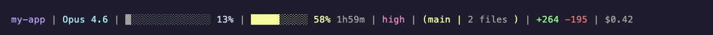
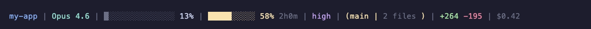
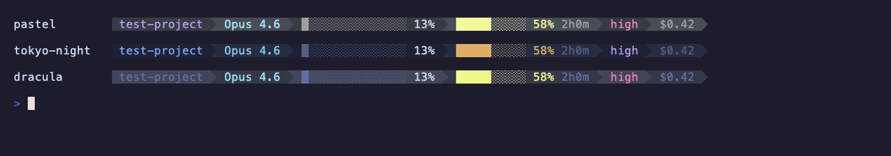

# ccvitals

[](https://github.com/educlopez/ccvitals/actions/workflows/shellcheck.yml)
[](https://github.com/educlopez/ccvitals/releases)
[](LICENSE)


The vital signs of your [Claude Code](https://docs.anthropic.com/en/docs/claude-code) session — usage quota, context window, cost, git status and more, right in your terminal. Pure bash, zero Node, never blocks your prompt.


## Why ccvitals

| | ccvitals | Node-based statuslines |
|---|---|---|
| Runtime | **pure bash + jq** | Node.js ≥ 14–18 |
| Render blocking | **never** — stale-while-revalidate cache, background refresh | varies |
| Rate-limit data | stdin first (zero-latency), OAuth API fallback | usually API calls |
| 1M context tier | **detected** — context % stays accurate past 200k | mostly assumes 200k |
| Two-line layout | yes | rare |
| Install | plugin marketplace or git clone + symlink (`git pull` = update) | npx / npm |

## Install

Install ccvitals as a Claude Code plugin — no cloning or manual config required:

```
/plugin marketplace add educlopez/ccvitals
/plugin install ccvitals@ccvitals
/ccvitals:setup
```

`/ccvitals:setup` asks which modules you want, writes the config, and wires up `settings.json` automatically. Then restart Claude Code.

To reconfigure modules or switch to a two-line layout later:

```
/ccvitals:configure
```

### Manual install (alternative)

If you prefer a git-clone workflow (symlinked install, instant `git pull` updates):

```bash
git clone https://github.com/educlopez/ccvitals.git
cd ccvitals
./install.sh
```

The installer shows an interactive menu where you pick which modules to enable:

```
ccvitals — Choose your modules:

  [x] 1) Directory      my-project
  [x] 2) Model          Opus 4.6
  [x] 3) Context        ░░░░░░░░░░░░░░░ 12%
  [x] 4) Usage quota    Max ██████░░░░ 58% 3h42m
  [x] 5) Git status     (main | 3 files +42 -8)

  Toggle: enter number (e.g. 4). Accept: Enter. All: a
```

Then restart Claude Code.

#### Install options

```bash
# Force reinstall (relink script + overwrite settings.json statusLine key)
./install.sh --force

# Skip menu — install all modules
./install.sh --all

# Skip menu — pick specific modules
./install.sh --modules=model,context,usage

# Two-line layout (these modules drop to row 2)
./install.sh --all --line2=context,usage,rtk,mode,lines

# Combine flags
./install.sh --force --modules=context,usage,git
```

The interactive installer also asks, after you pick your modules, which of
them should drop to a second line (enter their numbers, or press Enter for a
single line).

#### Update

```bash
cd ccvitals && git pull
```

Because the script is symlinked, `git pull` updates the statusline instantly —
no reinstall needed. Restart Claude Code to see the new version.

#### Change modules later

Run `/ccvitals:configure` (plugin install) or re-run the installer with `--force`. You can also edit `~/.claude/.statusline-config.json` directly:

```json
{
  "modules": ["directory", "model", "context", "usage", "git", "rtk", "codegraph", "lines", "mode", "cost", "duration", "speed", "vim", "agent", "pr", "weekly"]
}
```

Remove any module from the array to hide it.

### Two-line layout

Add an optional `modules_line2` array to render those modules on a **second row**. Modules stay in `modules` for line 1; anything in `modules_line2` drops to line 2. Omit `modules_line2` entirely for a single line.

```json
{
  "modules": ["directory", "model", "git", "codegraph"],
  "modules_line2": ["context", "usage", "rtk", "mode", "lines"]
}
```

Renders as:

```
my-project | Opus 4.6 | (main | 3 files +42 -8) | ⬡ 11.7k
███░░ 21% ⚠ | Max 58% 3h42m | rtk 86.8%↓ | ⚡ xhigh | +264 -195
```

## Modules

| Module | What it shows |
|--------|---------------|
| `directory` | Current project folder name |
| `model` | Active model (Opus 4.6, Sonnet 4.6, etc.) |
| `context` | Context window progress bar + percentage (default); set `"context_display": "tokens"` for `26.0k/200k` format, or `"both"` for `26.0k/200k 13%`; turns red with a `⚠` when the context is large (≥90%) |
| `usage` | 5h quota bar, reset timer, plan badge (Pro/Max/Team), 7d warning |
| `git` | Branch name, changed files count, lines added/removed; when an upstream exists, shows `↑N ↓M` ahead/behind counts (GREEN/YELLOW); branch name is a clickable OSC 8 link on GitHub/GitLab remotes |
| `rtk` | RTK token-savings % — e.g. `rtk 86.8%↓` (needs the `rtk` CLI) |
| `codegraph` | CodeGraph index size + stale marker — e.g. `⬡ 11.7k ⚠3` (needs the `codegraph` CLI; only shows in indexed projects) |
| `lines` | Lines added/removed this session — e.g. `+264 -195` (cumulative agent edits, distinct from the git working-tree diff) |
| `mode` | Reasoning effort level + fast-mode flag — e.g. `⚡ xhigh` |
| `cost` | Session cost in USD — e.g. `$0.42` (from stdin, zero-latency) |
| `duration` | Session wall-clock time — e.g. `1h23m` (from stdin, zero-latency) |
| `speed` | Token throughput — e.g. `42 tok/s` (delta between renders, cached per session) |
| `vim` | Vim mode indicator — `N` / `I` / `V` / `VL` with distinct colors |
| `agent` | Active agent name — e.g. `@ my-agent` (hidden when no agent active) |
| `pr` | Linked PR number and review state — e.g. `PR #123 approved` (hidden when absent); `PR #N` is a clickable OSC 8 hyperlink when `pr.url` is present |
| `weekly` | 7-day quota bar with reset countdown — e.g. `7d: ████░░░░░░ 38% 4d2h` |
| `pace` | Burn-rate vs 5h quota window — e.g. `pace +12%` (GREEN = under budget, YELLOW = slightly over, RED = burning fast); hidden when rate_limits absent |
| `cache` | Prompt-cache freshness countdown — e.g. `cache 4m12s` or `cache cold` (reads `transcript_path` from stdin; hidden when absent) |
| `tools` | Tools currently in flight — e.g. `⚒ Bash` (one pending) or `⚒ Bash +2` (first + overflow count); hidden when none pending; reads the last 300 lines of the transcript (never full file) |
| `agents` | Active sub-agents — e.g. `◉ code-reviewer` (one) or `◉ 3 agents` (several); hidden when none; reads transcript (tail-bounded) |
| `todos` | Latest TodoWrite progress — e.g. `☑ 3/7`; GREEN when all done, CYAN otherwise; hidden when no TodoWrite found; reads transcript (tail-bounded) |
| `daily` | Cross-session daily spend — e.g. `Σ $4.20`; with optional `daily_budget` config: `Σ $4.20/$10` colored GREEN/YELLOW/MAGENTA/RED by budget %age; prunes day-files older than 7 days |
| `compactions` | Count of `/compact` events in the transcript — e.g. `↯ 2`; hidden when 0; uses `grep -c` on the full file (fast, no jq) |
| `tokens` | Cumulative session input/output tokens — e.g. `⇅ 1.2M/45k`; incremental cache keyed by session; resets on compact; hidden when transcript absent |

> `rtk`, `codegraph`, `lines`, `mode`, `cost`, `duration`, `speed`, `vim`, `agent`, `pr`, `weekly`, `pace`, `cache`, `tools`, `agents`, `todos`, `daily`, `compactions`, and `tokens` are **opt-in** (off by default).
> `rtk` and `codegraph` cache their output (rtk 60s globally, codegraph 15s per
> project) and refresh in the background, so they don't slow down rendering;
> each silently hides itself when its CLI isn't installed. `tools`, `agents`, and
> `todos` share one `tail -n 300` + one `jq` invocation of the transcript per render,
> keeping the cost bounded regardless of transcript size. `compactions` uses `grep -c`
> on the full transcript (fast, O(n) line scan). `tokens` processes only new lines
> since the last render (incremental cache, negligible per-render cost).

## Features

- **Modular** — pick only the sections you want
- **Context window** — progress bar + percentage of context used
- **Usage quota** — 5-hour utilization with color-coded bar (Pro/Max/Team)
- **Reset timer** — countdown to when your 5h quota resets
- **7-day warning** — shows weekly utilization when above 70%
- **Git status** — branch name, changed files count, lines added/removed
- **Plan badge** — shows your subscription tier (Pro, Max, Team)
- **Smart caching** — usage data cached for 60s, refreshed in background
- **Cross-platform** — works on macOS, Linux, and WSL

## Color coding

| Usage level | Color |
|-------------|-------|
| 0-49% | Cyan |
| 50-74% | Yellow |
| 75-89% | Magenta |
| 90%+ | Red |

## Themes

ccvitals ships with six built-in color presets plus a custom mode. Set the `"theme"` key in `~/.claude/.statusline-config.json`:

#### `default` — classic 16-color ANSI (adapts to your terminal's palette; used when the key is absent)


#### `pastel` — soft lavender/cyan palette


#### `tokyo-night` — blue/purple night palette


#### `catppuccin` — Catppuccin Mocha


#### `dracula` — high-contrast Dracula


#### `nord` — arctic, cool-toned Nord


#### `mono` — bold/white only, no color


> **Why does `default` look different on my machine?** The `default` theme emits classic 16-color ANSI codes, so **your terminal's palette decides** the final colors — it blends in with whatever theme your terminal uses. The named presets use fixed truecolor values and look identical in every terminal.

Switch theme by running `/ccvitals:configure` (plugin install) or editing the config directly:

```json
{
  "modules": ["directory", "model", "context", "usage", "git"],
  "theme": "tokyo-night"
}
```

## Powerline mode

Set `"powerline": true` in `~/.claude/.statusline-config.json` to render each module as a shaded segment separated by the Nerd Font arrow glyph (U+E0B0, ``) instead of ` | `:



```json
{
  "modules": ["directory", "model", "context", "usage", "git"],
  "theme": "tokyo-night",
  "powerline": true
}
```

Segments alternate between two background shades drawn from the active theme. Each inter-segment boundary gets a `` glyph whose foreground color matches the previous segment's background, creating a seamless chevron effect. A final trailing arrow resets to the terminal default background.

> **Nerd Font required** — the `` glyph renders correctly only when your terminal uses a [Nerd Font](https://www.nerdfonts.com/) (e.g. JetBrainsMono Nerd Font, FiraCode Nerd Font, MesloLGS NF). Without one the separator appears as a box or question mark.

## Subagent rows

When Claude Code spawns sub-agents (e.g. during `/sdd-apply`, multi-agent workflows, or background tasks), it shows an agent panel below the prompt. ccvitals replaces the default `name · description · tokens` row for each sub-agent with a richer, theme-aware row:

```
◐ code-reviewer  Reviewing the auth module for security issues  1.2k  myproject
✓ formatter  Formatting complete  5.2M  other
```

Each row shows:
- **Status icon** — `◐` CYAN (running), `✓` GREEN (completed), `✗` RED (stopped/failed), `·` GRAY (unknown)
- **Label or name** of the sub-agent
- **Description** — truncated so the whole row fits within the available terminal width
- **Token count** — `1.2k` / `5.2M` format; hidden when zero
- **Project folder** — basename of the sub-agent's working directory

This is enabled automatically when you install ccvitals via `./install.sh` or `/ccvitals:setup`. The rows respect your active theme.

### Disable subagent rows

To keep Claude Code's default sub-agent panel, remove the `subagentStatusLine` key from `~/.claude/settings.json`:

```bash
jq 'del(.subagentStatusLine)' ~/.claude/settings.json > ~/.claude/settings.json.tmp \
  && mv ~/.claude/settings.json.tmp ~/.claude/settings.json
```

### Custom separator

Override the separator glyph with any string via `"powerline_separator"`:

```json
{
  "modules": ["directory", "model", "context"],
  "powerline": true,
  "powerline_separator": "▶"
}
```

Use a plain ASCII fallback (e.g. `"|"` or `">"`) if you don't have a Nerd Font installed.

### Custom colors

Set `"theme": "custom"` and supply a `"colors"` object with any of the seven color keys (`red`, `green`, `blue`, `yellow`, `cyan`, `gray`, `magenta`). Missing keys fall back to the default palette. Values must be `#RRGGBB` hex strings:

```json
{
  "modules": ["directory", "model", "context", "usage", "git"],
  "theme": "custom",
  "colors": {
    "blue": "#7aa2f7",
    "green": "#9ece6a",
    "magenta": "#bb9af7",
    "cyan": "#7dcfff",
    "yellow": "#e0af68",
    "red": "#f7768e",
    "gray": "#565f89"
  }
}
```

Truecolor terminals (iTerm2, Kitty, WezTerm, most modern Linux terminals) display the full RGB palette. The `default` and `mono` presets use the classic 16-color ANSI codes and work on every terminal.

## Module config keys

Some modules accept additional config keys in `.statusline-config.json`:

### `pace_display` — quota forecast mode (pace module)

```json
{ "pace_display": "eta" }
```

| Value | Display | Description |
|-------|---------|-------------|
| `"delta"` (default) | `pace +12%` | How far ahead/behind the expected burn rate |
| `"eta"` | `⌛ ~17:40` / `⌛ ok` | Estimated exhaustion time — RED if within 1h, YELLOW otherwise, GREEN if quota outlasts the reset |

### `daily_budget` — daily spend budget (daily module)

```json
{ "daily_budget": 10 }
```

Optional USD budget for the `daily` module. When set, displays `Σ $4.20/$10` with color:
GREEN <50%, YELLOW <80%, MAGENTA <100%, RED ≥100%.

### `weekly_split` — per-model weekly breakdown (weekly module)

```json
{ "weekly_split": true }
```

When `true` and the OAuth cache contains `seven_day_opus`/`seven_day_sonnet` utilization, displays `7d O:42% S:18%` instead of the single progress bar. Falls back to the bar when per-model data is unavailable (note: requires the OAuth fetch path to have run at least once).

## Requirements

- [Claude Code](https://docs.anthropic.com/en/docs/claude-code) CLI
- `jq` — JSON processor ([install](https://jqlang.github.io/jq/download/))
- `git` — to clone and update the repo
- `bash` 3.2+ (pre-installed on most systems)

> The statusline itself uses `curl` at runtime to fetch your usage quota, but
> the installer no longer downloads anything — it links the cloned `statusline.sh`.

## How it works

1. Claude Code pipes JSON context (model, workspace, context window) to the script via stdin
2. The script reads `~/.claude/.statusline-config.json` to know which modules are enabled
3. For the usage/weekly modules: prefers `rate_limits` data straight from Claude Code's stdin JSON (zero-latency, no network). When absent, falls back to fetching quota from the Anthropic API with OAuth credentials:
   - **macOS (Claude Code 2.x+):** reads from the macOS Keychain using profile-specific service names
   - **Fallback:** reads from `~/.claude/.credentials.json` (older Claude Code versions or non-macOS)
4. Usage data is cached locally (`~/.claude/.usage-cache/usage.json`) for 60 seconds to avoid blocking the statusline
5. Git info is gathered from the current workspace directory
6. Only enabled modules are rendered into the final colorized line

## Multi-account setup

If you use `CLAUDE_CONFIG_DIR` to manage multiple accounts, the statusline respects it:

```bash
CLAUDE_CONFIG_DIR=~/.claude-work claude
```

The installer also respects `CLAUDE_CONFIG_DIR` — run it with the variable set to install for a specific account. Each account gets its own module config.

## Compatibility

| Platform | Status |
|----------|--------|
| macOS | Supported |
| Linux | Supported |
| WSL | Supported |
| Windows (via Git Bash) | Supported |

## Uninstall

From the cloned repo:

```bash
./uninstall.sh
```

This removes the statusline symlink, module config, the `statusLine` key from your settings, and the usage cache directory. (The cloned repo is left untouched — delete it manually if you no longer want it.)

## License

MIT

